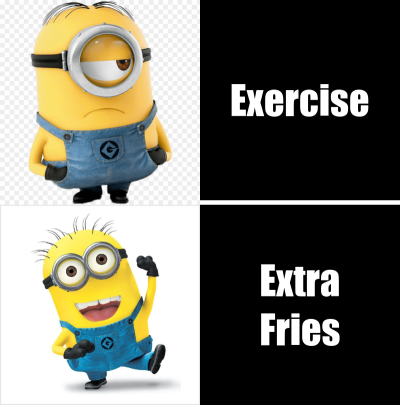

# Meme

## About my Meme
I got my inspiration for my meme from this other minions meme I found online which is shown below. I then made it into a four square meme rather then just all in one box.

### R Code for my Meme
library(magick)

sad_minion <- image_read("https://toppng.com/public/uploads/preview/15-sad-minion-png-for-free-on-mbtskoudsalg-awesome-notebook-notebook-journal-diary-lined-11563082197ihosrzfbek.png") %>%  
  image_scale(400)

box1_text <- image_blank(width = 400, 
                          height = 400, 
                          color = "#000000") %>%
  image_annotate(text = "Exercise",
                 color = "#FFFFFF",
                 size = 80,
                 font = "Impact",
                 gravity = "center")

happy_minion <- image_read("https://i.pinimg.com/736x/50/a3/fa/50a3fa735ae46b8b67212d320d6ba040--minion-mayhem-a-minion.jpg") %>%
  image_scale(400)

box2_text <- image_blank(width = 400, 
                       height = 400, 
                       color = "#000000") %>%
  image_annotate(text = "Extra\nFries",
                 color = "#FFFFFF",
                 size = 80,
                 font = "Impact",
                 gravity = "center")

minion_vector <- c(sad_minion, box1_text)
top_row <- image_append(minion_vector)
bottom_row <- image_append(c(happy_minion, box2_text))

meme <- c(top_row, bottom_row) %>%
  image_append(stack = TRUE) %>%
  image_scale(400)

  
image_write(meme, "my_meme.png")
